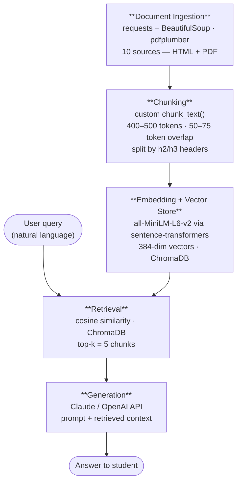

## Domain

**Financial Aid & Scholarships at San José State University**

This domain covers the full landscape of financial aid available to SJSU students — federal grants (Pell, FAFSA), California state aid (Cal Grant, Dream Act), SJSU campus and department scholarships, EOP grants, work-study, loans, and external scholarship resources — along with the step-by-step process for applying, verifying, and receiving disbursements.

This knowledge is valuable because while SJSU's Financial Aid and Scholarship Office (FASO) publishes official information, it is scattered across 15+ separate web pages, multiple PDFs, and department-specific subsites — making it nearly impossible for a student to get a complete picture in one place. A first-generation student trying to answer a simple question like "What aid am I eligible for as an undocumented student?" may need to navigate the main FASO site, the UndocuSpartan center, the California Dream Act page, and department scholarship listings separately, with no single source connecting them. The RAG system solves this by unifying all sources into one searchable knowledge base that can answer specific, high-stakes questions instantly — such as deadlines, eligibility requirements, award amounts, and verification steps — reducing the risk of students missing aid they qualify for simply because they didn't know where to look.

---

## Documents

| # | Source | Description | URL or location |
|---|--------|-------------|-----------------|
| 1 | SJSU FASO – Main Financial Aid Page | Overview of all aid types: grants, loans, scholarships, work-study; includes deadlines and application links | https://www.sjsu.edu/faso/ |
| 2 | SJSU FASO – Types of Aid | Detailed breakdown of every aid category available to SJSU students | https://www.sjsu.edu/faso/types-of-aid/ |
| 3 | SJSU FASO – Seven Steps to Financial Aid | Step-by-step guide to the full FAFSA/Dream Act application and disbursement process at SJSU | https://www.sjsu.edu/faso/process/seven-steps.php |
| 4 | SJSU FASO – Scholarships Page | Campus, department, and private scholarship options with eligibility details and tips | https://www.sjsu.edu/faso/types-of-aid/scholarships/index.php |
| 5 | SJSU FASO – Scholarship External Resources | Curated list of external scholarship databases (Fastweb, Bold.org, CollegeBoard, etc.) | https://www.sjsu.edu/faso/types-of-aid/scholarships/scholarship-resources.php |
| 6 | SJSU FASO – EOP Grant | Details on the Educational Opportunity Program grant for low-income and first-gen students | https://www.sjsu.edu/faso/types-of-aid/grants/eop-grant.php |
| 7 | SJSU Financial Aid Brochure 2025–26 (PDF) | Comprehensive printable guide covering all aid types, Cal Grant, Pell, deadlines, and verification | https://www.sjsu.edu/enrollmentmanagement/docs/fall2025/FinancialAid2025-26.pdf |
| 8 | SJSU AS – Associated Students Scholarships | A.S.-administered scholarships for continuing SJSU students including leadership and advocacy awards | https://www.sjsu.edu/as/departments/government/scholarships.php |
| 9 | SJSU FASO – Financial Aid Fraud Avoidance (PDF) | Official handout warning students about scams and fraudulent aid offers | https://www.sjsu.edu/faso/docs/Avoid_Financial_Aid_Fraud.pdf |
| 10 | SJSU UndocuSpartan – Financial Aid Resources | Financial aid options specifically for undocumented and AB 540 students at SJSU | https://www.sjsu.edu/undocuspartan/paying-for-college/fin-aid-resources.php |

---

## Architecture

---

## Chunking Strategy

**Chunk size:** 400–500 tokens (~1,800–2,200 characters)

**Overlap:** 50–75 tokens (~250 characters)

**Reasoning:**

The FASO documents are structured around discrete, self-contained aid topics — one section covers Cal Grant, the next Pell, the next EOP. Each section is typically 3–6 sentences and answers exactly one type of student question. A 400–500 token window captures one full section without bleeding into the next topic, keeping retrieved chunks precise and preventing mixed-aid responses (e.g., a chunk that conflates Pell Grant eligibility with loan repayment terms).

Chunking approach varies by source type:

- **HTML pages (Sources 1–6, 8, 10):** Split by heading tags (h2/h3) first, then by token limit if a section exceeds 500 tokens. Each heading in FASO pages (e.g., "Federal Pell Grant", "Cal Grant A and B", "Verification Process") naturally marks a new topic — this is semantic chunking where boundaries follow meaning, not arbitrary character counts.
- **PDFs (Sources 7, 9):** Source 7 (Financial Aid Brochure) has bold section headers — split on those, then by paragraph boundary if a section exceeds 500 tokens, never mid-sentence. Source 9 (Fraud handout) is short enough (~600 tokens total) to keep as a single chunk.

The 50–75 token overlap exists because FASO documents frequently carry context across sentence boundaries — an eligibility rule in the last sentence of one section may only make sense if you know the aid type named in that section's header. Overlap ensures the lead-in context is preserved at the start of the next chunk, preventing orphaned statements like "This grant requires a 2.0 GPA" with no reference to which grant.

Chunks that are too small (e.g., 100 tokens) would split eligibility, award amount, and deadline for the same aid type across separate chunks — a query about Cal Grant would retrieve only one piece of that picture. Chunks that are too large (e.g., 1,000+ tokens) would merge multiple aid types together, making it hard for the retriever to surface the one section that answers a specific question. The 400–500 range matches the natural section length of these documents.

---

## Retrieval Approach

**Embedding model:** `all-MiniLM-L6-v2` via `sentence-transformers`

**Top-k:** 5 chunks per query

**Reasoning:**

`all-MiniLM-L6-v2` is well-suited for this corpus because FASO documents use plain, formal English with consistent terminology. The model handles semantic similarity effectively — a student asking "How do I get free money for college?" will still retrieve chunks about grants and scholarships even though neither word appears in the query. Its 256-token context window comfortably fits the 400–500 token chunks when used for encoding the query itself, and its low latency makes it practical for a student-facing tool.

Top-k of 5 gives the LLM enough context to synthesize a complete answer across related sub-topics (e.g., a question about Cal Grant eligibility may need one chunk on income limits, one on GPA requirements, and one on the application deadline) without overwhelming the context window with irrelevant material. Retrieving too few (k=2) risks missing a critical piece of the answer; too many (k=10+) risks surfacing loosely related chunks about unrelated aid types that confuse the LLM's response.

Semantic search works here because the embedding model maps both the query and the document chunks into the same vector space — chunks that are conceptually related to the query cluster nearby even when exact wording differs. For example, "undocumented student money" and "California Dream Act financial assistance" will have similar vector representations because the model learns contextual meaning, not keyword overlap.

If cost were not a constraint, `text-embedding-3-large` (OpenAI) or `instructor-xl` would be worth evaluating — both offer longer context windows and stronger performance on domain-specific text. For an SJSU-specific tool with a multilingual student population, a multilingual model like `paraphrase-multilingual-MiniLM-L12-v2` would better serve students querying in Spanish or Vietnamese.

---

## Evaluation Plan

| # | Test Question | Expected Answer |
|---|---------------|-----------------|
| 1 | What is the priority deadline to apply for financial aid at SJSU? | March 2nd each year for both FAFSA and the California Dream Act application |
| 2 | How much can I receive from the SJSU Spartan Scholarship, and when is the deadline? | Awards range from $250 to $4,000 per year; the deadline is May 1st unless otherwise stated |
| 3 | Am I eligible for financial aid as an undocumented student at SJSU? | Yes — undocumented students can apply via the California Dream Act application (not FAFSA) and may be eligible for Cal Grant, EOP grants, and SJSU campus scholarships that do not require a Social Security number |
| 4 | What happens if I drop units after my financial aid is disbursed? | Students enrolled in less than full-time units must complete the Student Information Update form; failure to do so may result in required repayment of a portion of the aid received |
| 5 | What is the EOP grant and who qualifies for it at SJSU? | The Educational Opportunity Program grant provides financial assistance to low-income and first-generation undergraduate students; students must be admitted to SJSU as an EOP student through the Cal State Apply process and must complete FAFSA or the CA Dream Act application by January 31st |

---

## Anticipated Challenges

**1. Content duplication across sources**
The 2025–26 brochure PDF (Source 7) repeats much of the same information found in the HTML pages (Sources 1–4). Without deduplication, the retriever may surface near-identical chunks ranked side by side, wasting context window space and producing redundant answers. Mitigation: run a cosine similarity deduplication pass (threshold ~0.95) after embedding all chunks and remove near-duplicate entries before indexing.

**2. Stale or versioned information**
Several sources are annual documents (the brochure is 2025–26; the fraud handout may be undated). Deadlines, award amounts, and eligibility rules change each academic year. If a student queries the system after new documents are published but before sources are re-scraped, the system may confidently return outdated figures — e.g., an old scholarship dollar amount or a passed deadline. Mitigation: tag each chunk with a `source_date` metadata field and surface it in the LLM's response so students know to verify time-sensitive details with FASO directly.

**3. Chunks splitting cross-referenced information**
FASO pages frequently reference other pages mid-section (e.g., "For more information on loans, see the Seven Steps page"). If the chunk boundary falls right before that cross-reference, the retrieved chunk gives an incomplete answer with no pointer to where more detail lives. Mitigation: include source URL as metadata on every chunk so the LLM can cite where to go next, and prefer splitting at heading boundaries rather than mid-paragraph.

---

## AI Tool Plan

**1. Implementing `chunk_text()`**
Input to Claude: the Chunking Strategy section of this planning.md plus the raw scraped text of one HTML page (Source 3 – Seven Steps) and one PDF (Source 7 – Brochure).
Expected output: a Python function `chunk_text(text, source_type, chunk_size=450, overlap=60)` that splits by h2/h3 tags for HTML and by bold headers for PDFs, falls back to paragraph boundaries, and returns a list of dicts with `{text, source_url, source_type, chunk_index}`.

**2. Building the scraper**
Input to Claude: the Documents table from this planning.md listing all 10 URLs, noting which are HTML and which are PDFs.
Expected output: a Python script using `requests` + `BeautifulSoup` for HTML sources and `pdfplumber` for PDF sources, with per-source parsing logic and output saved as a list of raw text files.

**3. Deduplication pass**
Input to Claude: the Anticipated Challenges section describing the duplication risk, plus the chunk schema from step 1.
Expected output: a Python function `deduplicate_chunks(chunks, threshold=0.95)` that embeds all chunks with `all-MiniLM-L6-v2`, computes pairwise cosine similarity, and removes chunks that exceed the threshold keeping the one with the richer metadata.

**4. Evaluation harness**
Input to Claude: the Evaluation Plan table with all 5 test questions and expected answers.
Expected output: a Python script that runs each test question through the RAG pipeline, retrieves top-5 chunks, generates an LLM answer, and scores it as pass/fail by checking whether key expected facts (deadline dates, dollar amounts, program names) appear in the response.